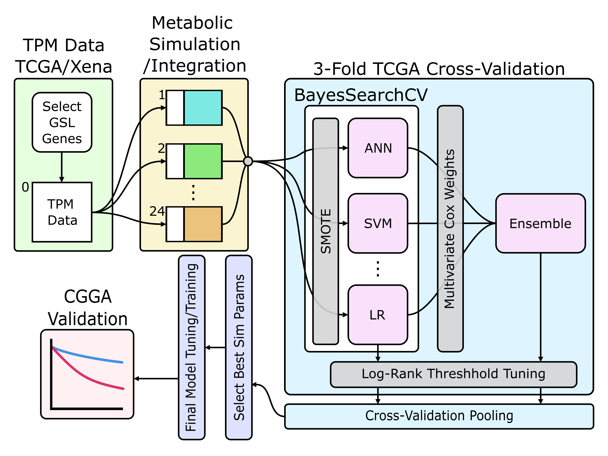

# LGG_Prognosis_Prediction

## Abstract
Glycosphingolipids (GSLs) are essential elements of biological membranes, with import roles in cancer. Disrupted GSL metabolism is associated with malignancy and severity across a range of different cancers, with different GSLs implicated in different tumours. GSLs have potential mechanistic roles in Glioblastoma Multiforme (GBM), however their functions in Lower Grade Gliomas (LGGs) are less well studied. Here we present ensemble machine learning approaches built on transcriptomic data for LGG alongside GSL-specific metabolic simulations to predict survival outcomes in LGG. The ensemble approach demonstrates effective risk stratification for LGG patients. We developed a python package to facilitate easy implementation of GSL-specific metabolic modelling strategies and to deploy our models to make risk predictions based on RNA-seq data. The resulting model derived risk groups offered biological insights to the potential roles of GSLs in LGG, highlighting cell motility, cell division, Wnt signalling and microtubule organisation as areas of interest for further research. We propose that GSL-based diagnostics and/or prognostics may prove clinically beneficial given the well-established shedding of GSLs into the tumour microenvironment as a route for detection paired with high performing machine learning approaches to model patient outcomes.

## Project Schematic
